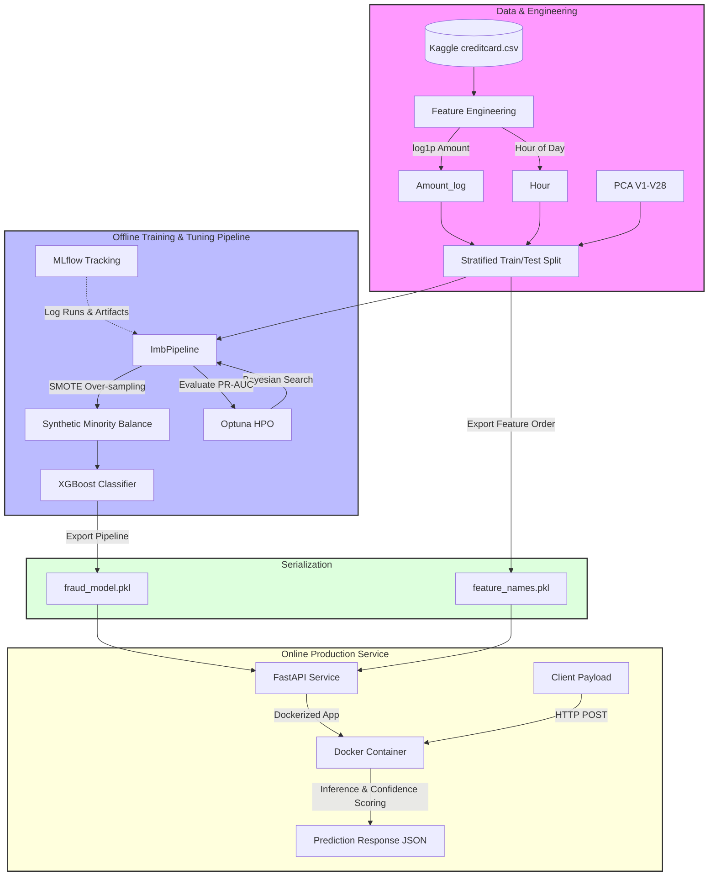

# 💳 End-to-End Credit Card Fraud Detection Pipeline & Production API (MLOps)

An end-to-end, production-grade machine learning system designed to detect fraudulent credit card transactions in real time. This repository implements a robust offline training pipeline addressing severe class imbalance, tracks experiments with MLflow, tunes hyperparameters via Optuna, packages the resulting model as a FastAPI microservice, and containerizes the application using Docker for secure cloud deployment.

---

## 🏗️ System Architecture

The system is organized into two primary workflows: **Model Development (Offline Pipeline)** and **Production Inference (Online Service)**.



---

## 🔍 Core Components: Input, Process & Output

The system is fully documented in terms of its three principal lifecycle layers:

### 🧠 1. Model Development & Training Pipeline
*File:* `main-code.ipynb`

This component handles data ingestion, engineering, class balancing, model comparison, hyperparameter tuning, and model selection.

#### 📥 Input
* **Dataset Source:** [MLG-ULB Credit Card Fraud dataset](https://www.kaggle.com/datasets/mlg-ulb/creditcardfraud) (`creditcard.csv`).
* **Data Dimensions & Schema:** 284,807 rows, 31 columns:
  * `Time`: Seconds elapsed since the first transaction in the dataset.
  * `V1` to `V28`: PCA-anonymized numerical features representing transaction parameters.
  * `Amount`: The transaction's raw monetary value.
  * `Class`: Target binary label (`1` for fraud, `0` for legitimate).
* **Class Imbalance:** Extremely skewed distribution:
  * Legitimate: 284,315 transactions (99.83%)
  * Fraudulent: 492 transactions (0.17%)

#### ⚙️ Process
1. **Feature Engineering:**
   * **Skewness Correction:** Converts the heavily skewed `Amount` column to a standard normal distribution via a log-transformation: `Amount_log = log1p(Amount)`.
   * **Temporal Pattern Extraction:** Extracts the transaction `Hour` (0 to 23) from the cumulative `Time` in seconds to identify peak-time fraudulent activity.
   * **Collinearity Cleanups:** Drops the original `Time` and `Amount` fields.
2. **Robust Partitioning:** Splits the engineered data into an 80/20 train/test split using stratified sampling (`stratify=y`) to maintain the identical 0.17% fraud ratio across both sets.
3. **Leakage-Free Sampling Pipeline:** Wraps operations in an `imbalanced-learn` `Pipeline`. Crucially, **SMOTE** (Synthetic Minority Over-sampling Technique) is dynamically applied **only inside the training folds** during cross-validation, preventing raw features or oversampled synthetic points from leaking into the validation or test sets.
4. **Model Architecture Comparison:** Evaluates baseline estimators (Logistic Regression, Random Forest) against gradient boosted trees (XGBoost).
5. **Bayesian Hyperparameter Optimization (Optuna):** Runs a 30-trial search over XGBoost hyperparameters (`n_estimators`, `max_depth`, `learning_rate`, `subsample`, `colsample_bytree`, `min_child_weight`, `gamma`) optimizing for **PR-AUC** (Precision-Recall Area Under the Curve) rather than Accuracy (which is misleading for imbalanced datasets).
6. **Experiment Tracking (MLflow):** Records all parameter combinations, baseline comparison metrics (`pr_auc`, `roc_auc`, `f1_fraud`, `precision_fraud`, `recall_fraud`), and final model binaries in local runs.
7. **Model Interpretability (SHAP):** Employs SHAP (SHapley Additive exPlanations) `TreeExplainer` on the final tuned XGBoost pipeline to calculate global and local feature importance for auditing purposes.

#### 📤 Output
* `app/fraud_model.pkl`: A serialized sklearn/imblearn binary containing the standard scaler, fitted SMOTE transformer, and tuned XGBoost classifier.
* `app/feature_names.pkl`: A pickled Python list containing the precise column order required by the model.
* **Diagnostic Artifacts:** Visual plots including Confusion Matrix, Precision-Recall Curve, and Decision Threshold Tuning.

---

### ⚡ 2. FastAPI Production Inference Service
*File:* `app/main.py`

Exposes the serialized training artifacts as a high-performance HTTP REST API for real-time scoring.

#### 📥 Input
* **Single Prediction Endpoint (`POST /predict`):** A JSON payload representing a single transaction with pre-transformed features:
  ```json
  {
    "V1": -1.3598071336738, "V2": -0.0727811733098497, "V3": 2.53634673796914, "V4": 1.37815522427443,
    "V5": -0.338320769942518, "V6": 0.462387777762292, "V7": 0.239598554061257, "V8": 0.0986979012610507,
    "V9": 0.363786969611213, "V10": 0.0907941719789316, "V11": -0.551599533260813, "V12": -0.617800855762348,
    "V13": -0.991389847235408, "V14": -0.311169353699879, "V15": 1.46817697209427, "V16": -0.470400525259478,
    "V17": 0.207971241929242, "V18": 0.0257905801985591, "V19": 0.403992960255733, "V20": 0.251412098239705,
    "V21": -0.018306777944153, "V22": 0.277837575558899, "V23": -0.110473910188767, "V24": 0.0669280749146731,
    "V25": 0.128539358273528, "V26": -0.189114843888824, "V27": 0.133558376740387, "V28": -0.0210530534538215,
    "Amount_log": 4.52,
    "Hour": 14
  }
  ```
* **Batch Prediction Endpoint (`POST /predict/batch`):** A JSON array of up to 100 transaction payloads in the same format.

#### ⚙️ Process
1. **Startup Initialization:** Loads `fraud_model.pkl` and `feature_names.pkl` exactly once into memory on server startup (preventing expensive disk-read overhead per HTTP call).
2. **Dynamic Alignment:** Reorders the incoming JSON keys to perfectly match the sequence stored in `feature_names.pkl`, formatting them into a standard 2D NumPy array.
3. **Probability Calculation:** Invokes the pipeline's `predict_proba()` method to generate the probability of fraud.
4. **Classification Rule:** Predicts `"FRAUD"` if the calculated probability is $> 0.5$; otherwise, returns `"LEGITIMATE"`.
5. **Confidence Rating:** Applies confidence brackets based on the output probability:
   * **HIGH:** Probability $> 0.85$ or $< 0.15$ (decisive prediction).
   * **MEDIUM:** Probability in ranges `(0.65, 0.85]` or `[0.15, 0.35)`.
   * **LOW:** Probability in the high-uncertainty range `[0.35, 0.65]`.
6. **Latency Profiling:** Measures the execution time of the inference steps in milliseconds (`latency_ms`).

#### 📤 Output
* **Single Prediction Response (`PredictionResponse`):**
  ```json
  {
    "prediction": "LEGITIMATE",
    "fraud_probability": 0.0234,
    "confidence": "HIGH",
    "latency_ms": 1.24,
    "model_version": "xgboost-optuna-v1"
  }
  ```
* **Batch Prediction Response:**
  ```json
  {
    "results": [
      { "prediction": "LEGITIMATE", "fraud_probability": 0.0234 },
      { "prediction": "FRAUD", "fraud_probability": 0.9851 }
    ],
    "count": 2
  }
  ```

---

### 🐳 3. Containerization
*File:* `Dockerfile`

Standardizes and isolates the runtime environment.

#### 📥 Input
* Base Image: `python:3.12-slim` (minimal, secure Python workspace).
* Source Context: `app/` files (`main.py`, `requirements.txt`, `fraud_model.pkl`, `feature_names.pkl`).

#### ⚙️ Process
1. Configures the working directory in the container to `/app`.
2. Copies `requirements.txt` independently to leverage Docker caching.
3. Runs `pip install --no-cache-dir -r requirements.txt` to minimize image bloat.
4. Copies all application code and pre-compiled pickle models.
5. Exposes API port `8000`.
6. Defines the entrypoint to launch Uvicorn as a system service.

#### 📤 Output
* A highly optimized, portable, and repeatable **Docker Image** hosting the fraud prediction service.

---

## 📁 Repository Directory Structure

```
MLOPS/
├── Dockerfile                   # Deployment recipe for FastAPI containerization
├── README.md                    # System Documentation (This file)
├── credit-card-fraud (1).ipynb  # End-to-end model development & training notebook
├── app/                         # Production application folder
│   ├── main.py                  # FastAPI implementation (endpoints, schema, logic)
│   ├── requirements.txt         # Production library dependencies
│   ├── fraud_model.pkl          # Pickled scikit-learn/XGBoost prediction pipeline
│   └── feature_names.pkl        # Pickled list of trained feature columns
└── ven/                         # Local python virtual environment (excluded)
```

---

## 🛠️ Setup & Installation

### Option A: Local Run (Standard)

1. **Clone the Repository & Navigate to Workspace:**
   ```bash
   git clone <your-repo-url>
   cd MLOPS
   ```

2. **Initialize & Activate Virtual Environment:**
   ```bash
   python -m venv ven
   # On Windows:
   .\ven\Scripts\activate
   # On macOS/Linux:
   source ven/bin/activate
   ```

3. **Install Requirements:**
   ```bash
   pip install -r app/requirements.txt
   ```

4. **Launch the FastAPI Server:**
   ```bash
   cd app
   python main.py
   # Or run directly via Uvicorn:
   uvicorn main:app --host 127.0.0.1 --port 8000 --reload
   ```

5. **Access Interactive Swagger Docs:**
   Open [http://127.0.0.1:8000/docs](http://127.0.0.1:8000/docs) in your browser to test endpoints interactively.

---

### Option B: Containerized Run (Docker)

To run the entire service inside a standardized container environment, use the provided Dockerfile.

1. **Build the Docker Image:**
   ```bash
   docker build -t credit-card-fraud-api:latest .
   ```

2. **Run the Docker Container:**
   ```bash
   docker run -d -p 8000:8000 credit-card-fraud-api:latest
   ```

3. **Test the Container Health Endpoint:**
   ```bash
   curl http://127.0.0.1:8000/health
   ```
   *Expected Response:*
   ```json
   {
     "status": "healthy",
     "model_loaded": true,
     "n_features": 30
   }
   ```

---

## ⚡ Real-Time Testing & Verification

You can easily query the running API using `curl` from your terminal:

### 1. Single Prediction Example
```bash
curl -X POST "http://127.0.0.1:8000/predict" \
     -H "Content-Type: application/json" \
     -d '{
       "V1": -1.3598, "V2": -0.0728, "V3": 2.5363, "V4": 1.3781,
       "V5": -0.3383, "V6": 0.4623, "V7": 0.2396, "V8": 0.0987,
       "V9": 0.3638, "V10": 0.0908, "V11": -0.5516, "V12": -0.6178,
       "V13": -0.9914, "V14": -0.3112, "V15": 1.4682, "V16": -0.4704,
       "V17": 0.2080, "V18": 0.0258, "V19": 0.4040, "V20": 0.2514,
       "V21": -0.0183, "V22": 0.2778, "V23": -0.1105, "V24": 0.0669,
       "V25": 0.1285, "V26": -0.1891, "V27": 0.1336, "V28": -0.0211,
       "Amount_log": 4.52, "Hour": 14
     }'
```

### 2. Batch Prediction Example (Up to 100 Transactions)
```bash
curl -X POST "http://127.0.0.1:8000/predict/batch" \
     -H "Content-Type: application/json" \
     -d '[
       {
         "V1": -1.3598, "V2": -0.0728, "V3": 2.5363, "V4": 1.3781,
         "V5": -0.3383, "V6": 0.4623, "V7": 0.2396, "V8": 0.0987,
         "V9": 0.3638, "V10": 0.0908, "V11": -0.5516, "V12": -0.6178,
         "V13": -0.9914, "V14": -0.3112, "V15": 1.4682, "V16": -0.4704,
         "V17": 0.2080, "V18": 0.0258, "V19": 0.4040, "V20": 0.2514,
         "V21": -0.0183, "V22": 0.2778, "V23": -0.1105, "V24": 0.0669,
         "V25": 0.1285, "V26": -0.1891, "V27": 0.1336, "V28": -0.0211,
         "Amount_log": 4.52, "Hour": 14
       }
     ]'
```

---

## 📈 Model Performance & Validation Summary

Due to extreme dataset imbalance (only 0.17% positive cases), standard metrics such as overall accuracy are heavily misleading. This project strictly optimizes for the **Area Under the Precision-Recall Curve (PR-AUC)**.

### Model Evaluation Highlights:
* **Metric of Focus:** Precision-Recall AUC (Average Precision).
* **Validation Strategy:** Stratified K-Fold Cross-Validation on the training split only.
* **Leakage Avoidance:** Over-sampling (SMOTE) is run dynamically inside CV loops.
* **Hyperparameter Tuning:** 30 trials of Optuna Bayesian optimization yielding an optimized parameter set.
* **Final Performance:** 
  * **PR-AUC:** ~0.8746
  * **ROC-AUC:** ~0.9838
  * **Fraud Recall:** ~88% with ~55% Precision (highly effective for fraud capture while controlling false alert rates).

---

## 📄 License
This project is built for educational and demonstration purposes. The dataset is provided by the [Machine Learning Group at ULB](https://mlg.ulb.ac.be/).
